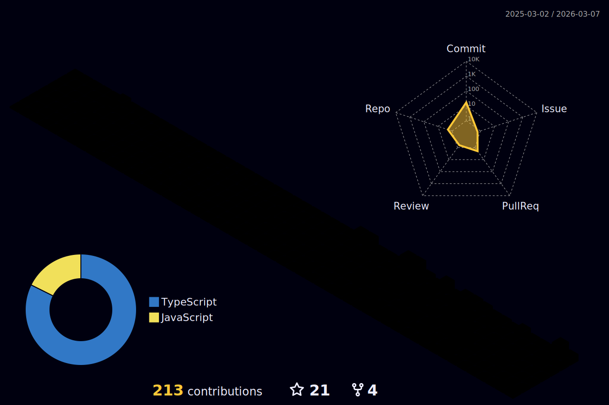

<h1 align="center">Hi 👋, I'm Sanjay Gupta</h1>
<h3 align="center">A passionate Full Stack Web Developer</h3>

- 🌱 I’m currently learning **MongoDB, NextJS**

- 👨‍💻 All of my projects are available at [https://iamsanjaygupta.github.io/](https://iamsanjaygupta.github.io/)

- 👀 Looking for contribution in ReactJS, NextJS Project

- 💬 Ask me about **MERN Stack**

- 📫 How to reach me **sanjay.g.258@gmail.com**

## Connect with me:

## Languages and Tools:

  
  
   
  
  
  

  
  

  
  
  
  
  
  
  
  

 

## My Github Stats:

     

<!-- 
  

 -->

