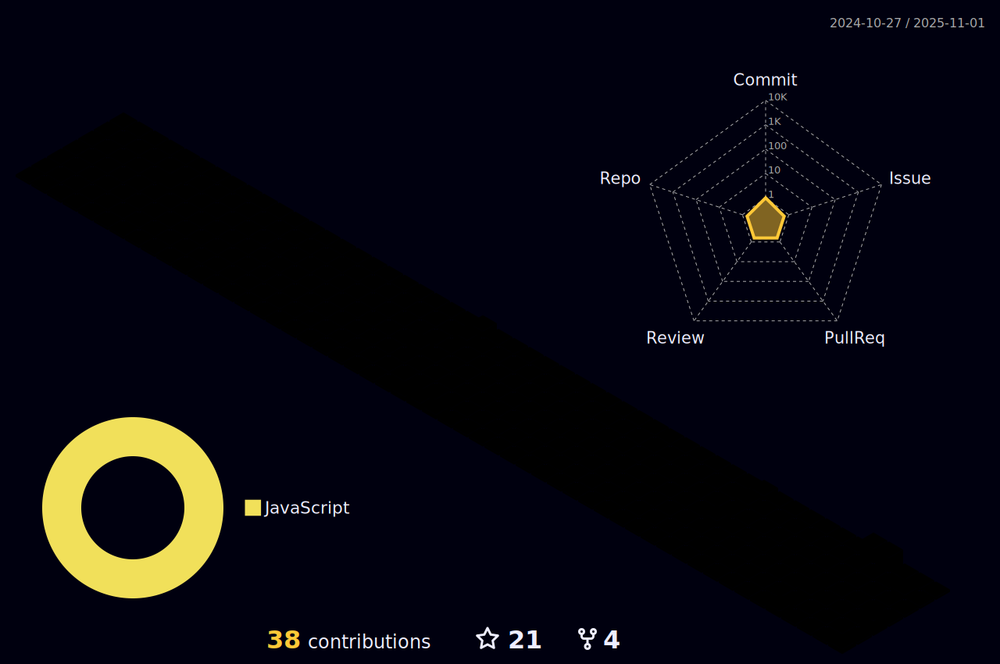

<h1 align="center">Hi 👋, I'm Sanjay Gupta</h1>
<h3 align="center">A passionate Full Stack Web Developer</h3>

With a year's experience as a Full Stack Developer and 1000+ hours of intensive bootcamp training, I'm passionate about applying coding skills to craft innovative solutions. From architecting robust backend systems in NestJS to seamlessly integrating APIs like Twilio and Google Calendar, I thrive on the challenge of creating dynamic web applications. With a keen eye for detail, I pride myself on crafting intuitive user experiences and optimizing performance through meticulous testing. My journey is fueled by the endless possibilities of coding and the opportunity to make a meaningful impact through quality software development.

 

- 🌱 I’m currently learning **PostgreSQL, NextJS**

- 👨‍💻 All of my projects are available at [https://iamsanjaygupta.github.io/](https://iamsanjaygupta.github.io/)

- 👀 Looking for contribution in ReactJS, NodeJS Project

- 💬 Ask me about **MERN Stack**

- 📫 How to reach me **sanjay.g.258@gmail.com**

- 📃 My [Resume](https://github.com/IamSanjayGupta/RESUME/raw/main/Sanjay-Gupta-Resume.pdf)

## Connect with me:

## Languages and Tools:

  
  
   
  
  
  
    

  
  

  
  
  
  
  

 

## My Github Stats:

     

<!-- 
  

 -->

